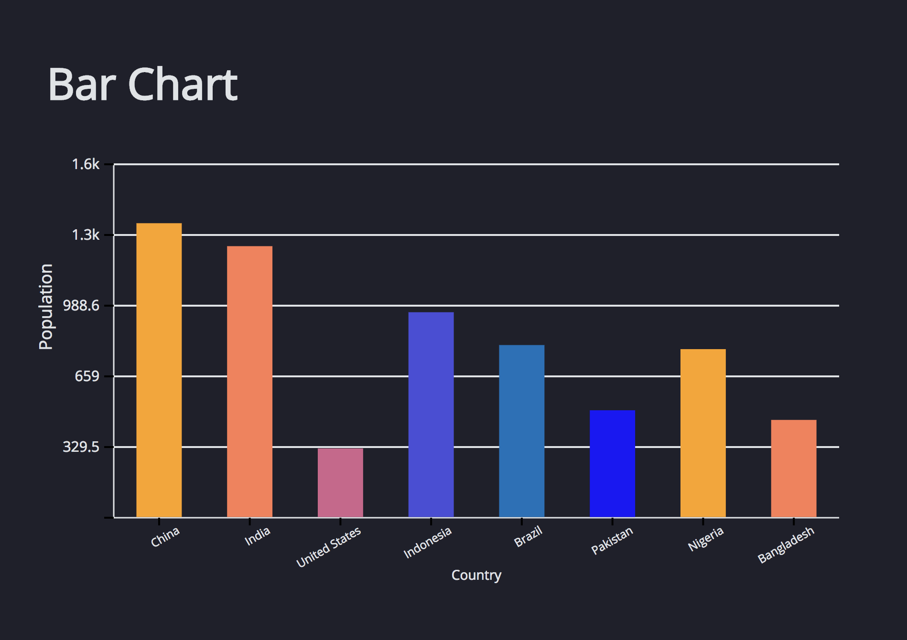
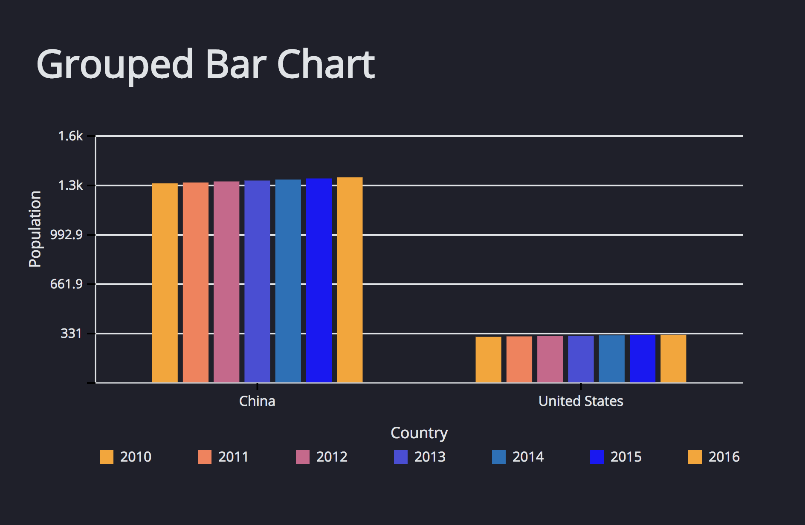

# Bar chart for react
Intelligent and customizable bar graph components for react.

## Installation
Only works with React projects. React must be installed separately.
```bash
npm install replot-bar
```

Then with a module bundler like webpack/browserify that supports CommonJS/ES2015
modules, use as you would anything else.

```javascript
import BarGraph from 'replot-bar'
```

## API
replot-bar is designed to easily create BarGraphs.
The only *required* input is proper JSON formatted data.

### Basic Usage
In the simplest case, just supply data (as a Javascript array) and specify the
keys associated with the values:



```javascript
render() {
  let populations = [
    {population: 1373, country: "China"},
    {population: 1266, country: "India"},
    {population: 323, country: "United States"},
    {population: 958, country: "Indonesia"},
    {population: 805, country: "Brazil"},
    {population: 501, country: "Pakistan"},
    {population: 786, country: "Nigeria"},
    {population: 456, country: "Bangladesh"}
  ]

  return(
    <BarGraph data={populations}
      xKey="country"
      yKey="population"/>
  )
}
```

- `data` is the only required prop
- `groupKey` defaults to `"group"`
- `xKey` defaults to `"x"`
- `yKey` defaults to `"y"`

#### Grouped Bar Graph

You can supply the data as array of JSON objects.



```javascript
render() {
  let populations = [
    {weight: 1379, country: "China", year: 2016},
    {weight: 1371, country: "China", year: 2015},
    {weight: 1364, country: "China", year: 2014},
    {weight: 1357, country: "China", year: 2013},
    {weight: 1351, country: "China", year: 2012},
    {weight: 1344, country: "China", year: 2011},
    {weight: 1338, country: "China", year: 2010},
    {weight: 323, country: "United States", year: 2016},
    {weight: 321, country: "United States", year: 2015},
    {weight: 319, country: "United States", year: 2014},
    {weight: 316, country: "United States", year: 2013},
    {weight: 314, country: "United States", year: 2012},
    {weight: 312, country: "United States", year: 2011},
    {weight: 309, country: "United States", year: 2010}
  ]

  return(
    <BarGraph data={populations}
      xKey="year"
      yKey="weight"
      groupKey="country"/>
  )
}
```

- `groupKey` is number or string.

### Dimensions
Dimensions may be specified by passing in `width` and `height` props. The
unit is pixels, and the BarGraph defaults to 800 by 600 pixels.

Width dimensions may also be specified with a string, as a percentage. The width
will then be calculated as a proportion of the parent container.

```javascript
render() {
  return(
    <BarGraph data={populations} width="50%" height="200px" />
  )
}
```

### Colors
Colors may be specified through 2 different mechanisms, both through a `color` prop.
If none of the mechanisms are specified, BarGraph defaults to a built in
color palette.

#### User-provided Color Palette
Users can specify a list of colors to use as a palette, passed to the `color` prop.

```javascript
render() {
  let colors = [
    "#fea9ac", "#fc858f", "#f46b72", "#de836e",
    "#caa56f", "#adcc6f", "#8ebc57", "#799b3f"
  ]

  return(
    <BarGraph data={populations} color={colors} />
  )
}
```

#### User-provided Color function
Users can also specify a function to assign colors to different bars. Expected arguments to the function are the index of the bar (from 0), its corresponding x-value, and its group (if it exists).

```javascript

colorMe(i, value, group) {
  if (group === "USA"){
    return "red"
  } else if (group === "China") {
    return "blue"
  }
}

render() {
  return(
    <BarGraph data={populations} color={this.colorMe} />
  )
}
```

### Tooltip
Tooltips can display more specific information about a bar.

```javascript
render() {
  return(
    <BarGraph data={populations} tooltip="true" tooltipColor="dark" />
  )
}
```

- `tooltip` defaults to `true`, `false` turns the tooltip off
- `tooltipColor` defaults to `light`, it can be set to `light` or `dark`
- `tooltipContents` defaults to the x-value, y-value, and group for a bar

#### User-provided Tooltip Function
Users can customize what is displayed inside the tooltip with a function. Expected arguments to the function are the data for the specific point hovered over and an array of data for the line hovered over. The function should return JSX.

```javascript
fillTooltip(data) {
  return (
    <div>
      <span>This bar is made with this data: {data}</span>
    </div>
  )
}

render() {
  return(
    <BarGraph data={populations} tooltipContents={this.fillTooltip} />
  )
}
```

### Axis Customization
Users can customize graph axes in several different ways.

#### Titles
Title props accept strings to display in the appropriate location on the graph. To compensate for the inclusion of a title, graph content will be condensed, but the overall size of the component will stay constant.

- `graphTitle`: string displayed above the graph
- `xTitle`: string displayed left of the x-axis
- `yTitle`: string displayed under the y-axis

```javascript
render() {
  return(
    <BarGraph data={populations}
      graphTitle="Annual Population in the US and China"
      xTitle="Year"
      yTitle="Population" />
  )
}
```

#### Displaying Axis Elements
Users can customize the display of the lines, labels, and gridlines of the axes.

- `showXAxisLine`: defaults to `true`, controls display of the x-axis line
- `showYAxisLine`: defaults to `true`, controls display of the y-axis line
- `showXLabels`: defaults to `true`, controls display of labels on the x-axis
- `showYLabels`: defaults to `true`, controls display of labels on the y-axis
- `showGrid`: defaults to `true`, controls display of gridlines

#### Axis Scale
Users can control the scale of the graph, linear or logarithmic. Users can also control the number of increments on the y-axis.

- `yScale`: defaults to `"lin"` for linear scale, can be `"log"` for logarithmic scale
- `ySteps`: defaults to 1 division per 100 pixels, accepts a number given by the user

#### Axis Style
Users can customize axis style by passing a javascript object to the `axisStyle` argument. Keys can include:

* axisColor
  * modifies the color of the axis line
  * defaults to `#000000`
  * accepts any color string
* labelColor
  * modifies the color of both axis labels
  * defaults to `#000000`
  * accepts any color string
* titleColor
  * modifies the color of all graph titles
  * defaults to `#000000`
  * accepts any color string
* labelColor
  * modifies the color of axis gridlines
  * defaults to `#DDDDDD`
  * accepts any color string
* lineWidth
  * modifies the thickness of axis lines
  * defaults to `2`
  * accepts any number
* lineOpacity
  * modifies the opacity of axis lines
  * defaults to `1`
  * accepts any number

```javascript
let style = {
  axisColor: "#f17e33",
  labelColor: "blue",
  titleColor: "#000000",
  gridColor: "#DDDDDD",
  lineWidth: 5,
  lineOpacity: .5
}

render() {
  return(
    <BarGraph data={populations} axisStyle={style} />
  )
}
```

### Legend Customization
Users can customize the graph legend in several ways.

- `showLegend`: defaults to `true` if there is a group key, controls display of the legend

#### Legend Style
Users can customize legend style by passing a javascript object to the `legendStyle` argument. Keys can include:

* fontColor
	* Modifies the color of the font used in the legend
	* Defaults to `"#000000"`
	* Accepts any color string
* backgroundColor
	* Modifies the background color of the legend
	* Defaults to `"none"`
	* Accepts any color string
* showBorder
 	* Determines whether a border will be drawn around the legend
	* Defaults to `true`
	* Accepts `true` or `false`
* borderColor
	* Modifies the color of the border of the legend
	* Defaults to `"#000000"`
	* Accepts any color string

### Animation Customization
Users can control the initial animation of the graph, bars growing out from the y-axis line.

- `initialAnimation`: defaults to `true`, controls the animation
